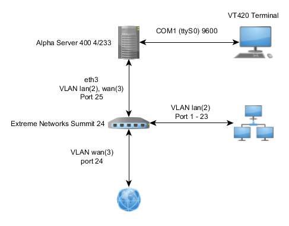

ISP course, първа сбирка
=========================

* Свързаност
    * външна свързаност: ssh cassie.initlab.org:2202
    * или през мрежата на initlab: 172.31.190.44

* Настроени неща


Топология
--------------

* С връзка през модем - Layer 3


* С връзка през модем - Layer 1


* С връзка през VLAN - Layer 3


* С връзка през VLAN - Layer 1



Графиките са създадени с [yEd Graph Editor](http://www.yworks.com/en/products/yfiles/yed/)

ppp config (stopped)
--------------------

* pppd
    * /etc/ppp/peers/initlab
        ```
        /dev/ttyS1
        115200
        noipdefault
        usepeerdns
        defaultroute
        persist
        noauth
        ```
        * starts with `pon initlab`
        * stops with `poff initlab`
    * modem
        * connected on COM2 (ttyS1) on Alpha
        * config Analog Port (0400)
            * Dial/Lease (0401): 2-wire lease
        * DTE Format (0600)
            * Asyn DTE Rt (0604): 115200
            * Parity (0605): None
            * Data bits (0606): 8
            * Stop bits (0607): 1

Адресиране
------------

* Локална мрежа - vlan 2, 10.1.2.0/24
* Външна връзка - 172.31.190.44/24, gw 172.31.190.1

* раздадени адреси
* alpha - 10.1.2.1/24
* switch - 10.1.2.2
* dhcp - 10.1.2.128/25

alpha
-----


Extreme  Summit 24
------------------
Created and configured 2 VLANs

VLAN `lan`
* ip addr: 10.1.2.2 mask: 255.255.255.0
* Ports 1-23  - untagged
* Port  25    - tagged

VLAN `wan`
* ip addr && netmask: not configured
* Port 25  - tagged
* Port 24  - untagged

!!! Password reset procedure: !!!
1. Connect switch to local serial console
2. Cold boot your device (power of the device, wait a minute, power on the device)
3. In the very beginning of the boot process press Space to enter boot menu
4. 
    - Press “1” to select primary boot image
    - Press “k” to erase current configuration
    - Press “d” to load default configuration
    - Press “f” to load switch with reset config

The result of this procedure is a switch with default login: admin and an empty password.


Бележки
--------

* cisco 3000 switch resetting & config, що не го ползваме -не поддържа настройка на VLAN-и. Нямаше да ни свърши работа.
* configuration of extreme switch


DHCP configuration : 
--------------------
* DHCP Pool: `10.1.2.128/25`

* dhcpd.conf:
    ```
    subnet 10.1.2.0 netmask 255.255.255.0 {
      range 10.1.2.128 10.1.2.253;
      option domain-name-servers 10.1.2.1;
      authoritative;
      option domain-name "initlab.org";
      option routers 10.1.2.1;
      option broadcast-address 10.1.2.255;
      default-lease-time 84600;
      max-lease-time 676800;
    }
    ```
* /etc/default/dhcp.conf
    ```
    INTERFACES="eth3.2"
    ```

NAT configuration:
-------------------------

* /etc/init.d/firewall
    ```
    #!/bin/sh

    # iptables location
    ipt=/sbin/iptables

    # enable the network forward
    echo 1 > /proc/sys/net/ipv4/ip_forward

    # stop ping (1 - on; 0 - off)
    echo 0 > /proc/sys/net/ipv4/icmp_echo_ignore_all

    # clear all iptables rules
    $ipt -F
    $ipt -X
    $ipt -F -t mangle
    $ipt -X -t mangle
    $ipt -F -t nat
    $ipt -X -t nat

    # DROP ALL FIREWALL RULL
    #$ipt -P INPUT DROP

    # prerouting rules
    $ipt -t nat -I POSTROUTING  -o eth3.3  ! -d 10.1.2.0/24 -j MASQUERADE

    * add to /etc/rc.local 
    /etc/init.d/firewall befor exit 0
    ```
